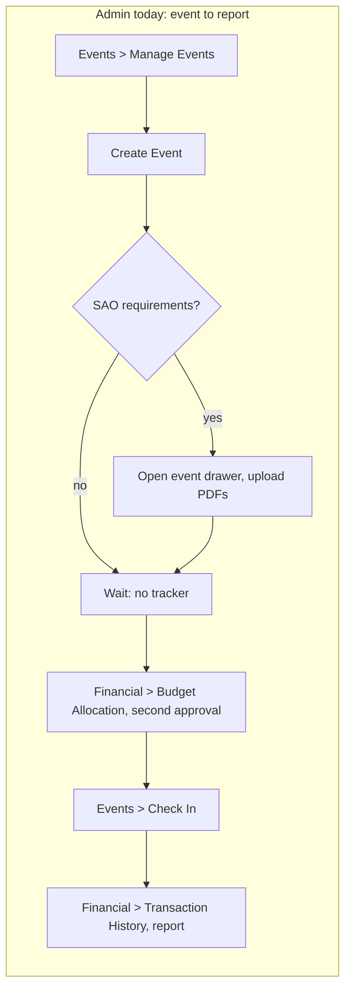
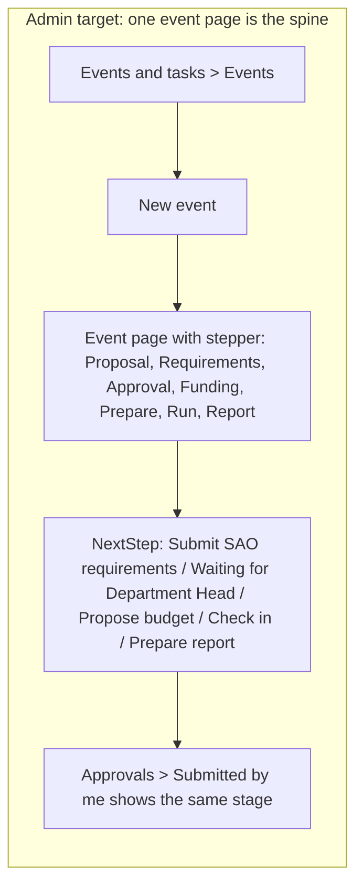
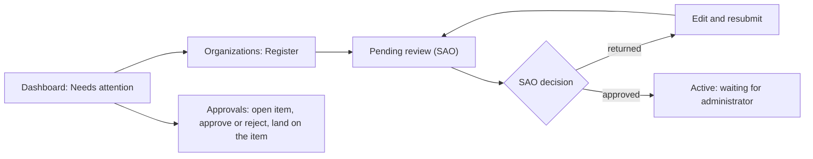
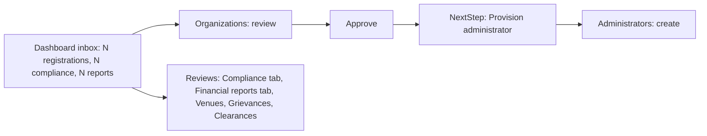
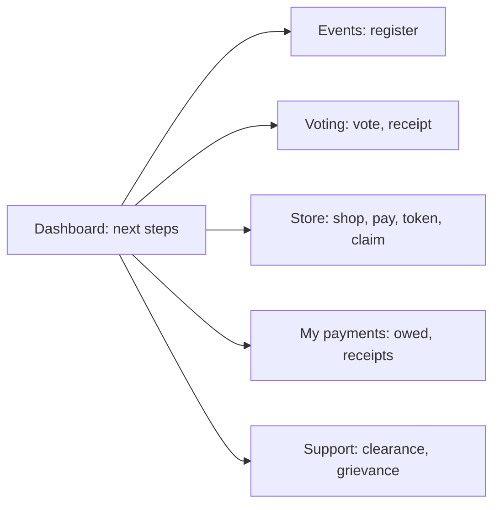
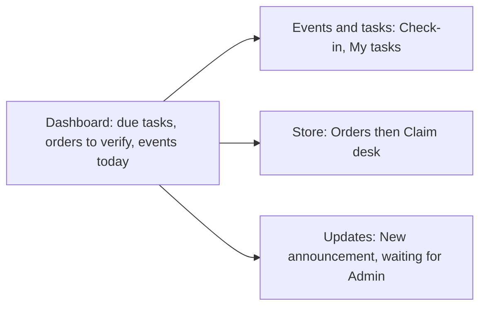
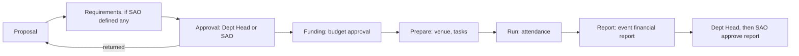
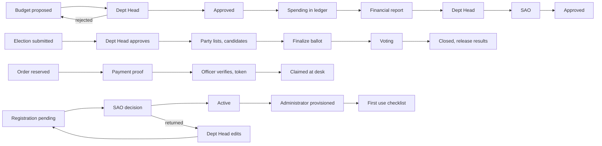

# HIUSA UX Flow: diagnosis, target information architecture and build plan

Date: 2026-10-10. Author: UX architecture review. Status: spec for the build, no code changed.

The dean's one repeated comment on the UI: the UX logic flow is not there, it is all over the place. This document finds where the flow breaks (with file and line evidence), and specifies the structure, sequence and guidance that fix it. The Design System in CLAUDE.md (palette, Poppins, spacing, components) is fixed and untouched. This is about structure, order and wayfinding only.

How to read the evidence: `file:line` cites the worktree at commit 0ba7487. Click counts are counted from the role's home page by reading `navigation.js`, `Sidebar.jsx` and the page source. Nothing was run in a browser (no servers were started), so every count is a source-derived estimate, marked "about" where a menu is involved. Section 10 lists what could not be verified.

## 1. Principles (the rules every page and menu is held to)

1. Navigation follows the process, not the module list. Items that a person uses in sequence sit next to each other, in the order the work happens.
2. Every page says where you are and what is next: a title, one purpose line, a breadcrumb, a stepper when the page belongs to a lifecycle, and exactly one primary action (Hick's Law: one obvious next move).
3. One job, one front door. Where two places do the same job, one page wins and the other becomes a redirect or a button on the winner.
4. Lifecycles are visible. Any record that moves through stages (event, budget, election, order, registration, report) shows its stage, who owns the next move, and the next action in words, never by color alone.
5. What needs me comes first. The inbox (approvals, returned items, waiting orders) is ahead of the browse-everything lists, for every role.
6. Every notification, briefing item and approval lands on the exact item, not on a list that contains it.
7. One word per thing. A concept keeps one name in the menu, the title, the buttons and the notifications. Personal activity (my orders, my receipts, my vote) is kept apart from management work.

## 2. Diagnosis

### 2.1 What the shell does today

- Menu: `navigation.js:23-155` is grouped by code module. ADMIN sees 12 top-level rows and 40 leaf links, SBO_OFFICER 10 and 26, DEPARTMENT_HEAD 7 and 10, STUDENT 7 and 11, SUPER_ADMIN 2 rows holding one flat list of 12 (`navigation.js:161-183`). Counts come from running `getNavForRole` on the file.
- Title and breadcrumb: `DashboardLayout.jsx:7-100` maps paths to titles; `TopBar.jsx:366-375` prints `Home / <group>` (group is plain text, not a link) plus one `h1` and a subtitle from a second map (`TopBar.jsx:119-186`).
- Pages: 11 pages (and the UI kit) render the shared `PageHeader` (grep `<PageHeader`), none pass `breadcrumbs` (grep `breadcrumbs=` returns nothing). Events, Finance, Tasks, Merchandise, Approvals and Manage Announcements render no `PageHeader` and no `EmptyState` (grep count 0 in each).
- Lifecycles: no stepper component exists (grep "stepper" in `pages` and `components` returns nothing; the only stage tracker is the 3 step order tracker, `MerchandisePage.jsx:226-246`).

### 2.2 Jobs to be done and the current path, per role

Clicks are counted from the role's home. "Expand" is the group click: groups with 2 or more children start collapsed unless you are already inside them (`Sidebar.jsx:242-250`), a group with one visible child renders as a plain link.

**STUDENT**

| Job | Current path | Clicks |
|---|---|---|
| Find and join an event | Events (single child, plain link) > event > Register in the drawer (`EventRegistrationPanel`) | 3 |
| Vote | Home "Cast ballot" (`StudentHomePage.jsx`, link to `/elections/:id/vote`) or Elections expand > Cast Vote > card > Vote. The vote page sits outside the dashboard layout (`App.jsx:310-312`) | 1 or 3 |
| Order merchandise and claim it | Merchandise expand > Order Merchandise > add > cart icon in TopBar > checkout > later My Orders for the GCash proof and the token | 5 plus return visits |
| See what I owe | Financial expand > Statement of Account. The home page has no balance, no clearance cue (`StudentHomePage.jsx` has only feed, election and events) | 2 |
| File a grievance | Governance expand > My Grievances > File a grievance (`StudentGrievancesPage.jsx:160,227`) > submit | 4 |
| Clear clearance | Governance expand > My Clearance | 2 |

**SBO_OFFICER**

| Job | Current path | Clicks |
|---|---|---|
| Check people in at an event | Events expand > Check In > pick event > pick member > confirm | about 5 |
| Verify a payment and release an order | Merchandise expand > Manage Orders > open order > verify; then Validate Tokens (a second sidebar item) to release | about 7 |
| Update my task | Task Management expand > Assigned Tasks > change status | 3 |
| Post an announcement (needs Admin approval) | Announcements expand > Create Announcement, or the separate top-level Submit Request > Announcement > Continue (3 clicks, same form: `App.jsx:219,234`) | 2 or 3 |
| Look something up in finance (read only) | Financial expand (6 children) > leaf | 2 |

**ADMIN (organization)**

| Job | Current path | Clicks |
|---|---|---|
| Plan an event and get it approved | Events expand > Manage Events > Create Event (`EventsPage.jsx:978`) > submit. If the SAO has defined event requirements the event gets no approval request yet (`EventController.php:301-309`): row menu > View event > upload PDFs > Submit (`EventsPage.jsx:1700`, `EventRequirementController.php:112-184`) | 4, or about 7 |
| Get it funded | Financial expand > Budget Allocation > Propose Budget (`FinancePage.jsx:1135`) > submit; an event with a proposed amount also creates a second, separate approval request (`EventController.php:311-328`) | 4 |
| Know where my submissions stand | No page. Approvals lists only requests where `required_role` is the Admin (`ApprovalRequestController.php:57`), which is officers' announcements and payments, not the Admin's own events, budgets, elections. Only path: open each item's drawer | about 4 per item |
| Run the event and take attendance | Events expand > Check In > pick event > record | about 4 |
| Report on it | Financial expand > Transaction History (this is the financial report builder, `FinancePage.jsx:1351-1356`) > pick report type "event" > generate > submit | about 5 |
| Set up the organization | Organization Setup expand > Manage Users / Manage Positions / Programs and Sections | 2 each |

**DEPARTMENT_HEAD**

| Job | Current path | Clicks |
|---|---|---|
| Register an organization | Organizations (item 7 of 7, `navigation.js:138`) > Register an organization (`CollegeOrganizationsPage.jsx:365`) > attach 10 PDFs > Submit. Needs an active semester or the form cannot submit (`CollegeOrganizationsPage.jsx:148`) | 3 |
| Approve what the college submitted | Approvals (item 6 of 7) > row action > remarks modal > confirm | about 3 |
| Follow up a returned registration | Home "Returned" status link (`DepartmentHeadHomePage.jsx:159`) or Organizations > Returned tab > organization > Edit and resubmit > Resubmit | 4 to 5 |
| Review college finance | Financial expand > leaf | 2 |
| Act from a notification | Bell > notification. Events land on the calendar (`notificationLinks.js:47-51`); budgets, tasks and orders resolve to nothing (`:53-56,65-67,72-74`) | 2, wrong place |

**SUPER_ADMIN (SAO)**

| Job | Current path | Clicks |
|---|---|---|
| Approve a new organization | SAO Administration expand > Organizations > Review > Approve (`SystemOrganizationsPage.jsx:126-127`). The home briefing never lists pending registrations (see break 22) | 4 |
| Give it an administrator | Administrators (another item, second in the list) > Create Admin User > fill > submit. The approval toast says only "approved and activated" (`SystemOrganizationsPage.jsx:101`) | 3 more |
| Review compliance | Compliance > Review queue tab > open > decide. The briefing link lands on the Accreditation tab, not the queue (`DashboardBriefingService.php:1170`, `SaoCompliancePage.jsx:16`) | 4 |
| Decide a financial report or an event with requirements | Compliance > Financial reports or Event requirements tab (`SaoCompliancePage.jsx:22-23`). There is no SAO Approvals item; `/super-admin/approvals` redirects (`App.jsx:216`) | 4 |
| Answer a grievance | SAO Administration expand > Grievances > open > set status | 4 |
| See who needs attention | Agency overview (first child) or the health table on the home page | 2 |

### 2.3 Logic breaks, with evidence

Category numbers follow the brief: 1 navigation order and grouping, 2 duplicate or orphan entry points, 3 pages without purpose, breadcrumb or next step, 4 lifecycles spread across pages, 5 dead ends and silent failures, 6 inconsistent vocabulary and patterns, 7 first use.

**Navigation order and grouping (1)**

1. The menu is a module list. Finance puts Digital Ledger first and Budget Allocation fourth (`navigation.js:43-46`), but a budget must exist and be approved before money is recorded against it (`BudgetController.php:333`, `TransactionController.php:322`). Financial reports are filed under "Transaction History" last-but-two (`:48`).
2. Elections list Candidates before Party Lists (`navigation.js:85-87`, `ElectionBreadcrumb.jsx` tab order) while finalizing a ballot requires at least one candidate in a party list (`ElectionController.php:268`) and every position to have candidates (`:262-265`).
3. Personal and management items share one list: Cast Vote (`:88`), Order Merchandise and My Orders (`:101-102`), My Receipts and Statement of Account (`:49-50`) sit inside the manager groups of Admin and Officer. Law of Proximity is broken: "approve the budget" and "see my receipt" are neighbors.
4. Names that do not say what is inside: "Governance" (`:142`) holds Compliance, Venues, Grievances, Clearances. "Organization Setup" (`:117`) holds, for an Officer, only "Participant Biometrics", which opens the same route as Admin's "Manage Users" (`:122-123`, `App.jsx:224`) whose title reads "User Management" (`DashboardLayout.jsx:30`).
5. CLAUDE.md fixes the order Dashboard, Members, Payments, Events, Voting, Reports, Settings. The live menu has none of the labels Members, Voting, Reports or Settings, and the order is Financial, Events, Tasks, Elections, Merchandise.
6. Primary jobs are buried. Department Head: Approvals and Organizations are rows 6 and 7 of 7, after four read-only groups (`navigation.js:128-138`). Admin: Approvals and Submit Request are rows 9 and 10 of 12 (`:128-139`). The first thing a reviewer does is the last thing in the menu.
7. SAO: one flat group of 12 with no process order (`navigation.js:164-181`). Administrators (provisioning, which follows approval) is second, Organizations third, Academic Years (a prerequisite of registration: HIER-01 refuses with no active semester) is fifth. Notifications is a page for the SAO only; every other role has a 10 item dropdown (`TopBar.jsx:203`).

**Duplicate or competing entry points, and orphans (2)**

8. Manage Events and Activity Calendar render the same `EventsPage initialTab="events"` for Admin (`App.jsx:240,244`); the page already has a List/Calendar toggle (`EventsPage.jsx:955-973`).
9. Approvals has two routes (`App.jsx:213,215`). Sidebar uses `/department-head/approvals` for the Department Head (`navigation.js:134`), the briefing and notifications use `/dashboard/approvals` (`DashboardBriefingService.php:158`, `notificationLinks.js:6-9`), so arriving from a briefing link leaves the Approvals menu item unhighlighted. Positions also has two routes and two labels, "SBO positions" on the Admin home (`AdminHomePage.jsx:12`) and "Manage Positions" in the menu (`App.jsx:225-226`).
10. Every create job has two doors: Submit Request > type (`App.jsx:218-222`, `SubmitApprovalRequestPage.jsx:5-39`) and the module's own button (event `EventsPage.jsx:978`, budget `FinancePage.jsx:1135`, election create modal `ElectionPickerPage.jsx:371`, announcement `App.jsx:219` and `:234`). The picker's heading is "1. Select request type" with no step 2 and no list of what you already submitted.
11. Three ways to make tasks: Create Task, Event Planner (page heading is "Build an Event To-do List", `EventsPage.jsx:1135`) and AI Delegation (`navigation.js:60,72,75`).
12. Elections show the same six links twice: sidebar children (`navigation.js:84-91`) and the in-hub tab strip (`ElectionBreadcrumb.jsx`). Sidebar clicks with no election selected drop into a picker (`ElectionsHub.jsx:75-80`).
13. Orphans. Study Objectives (`/dashboard/objectives`, open to all roles, `App.jsx:285`) has no link anywhere in the client (grep finds only `DashboardLayout.jsx:26`). `announcements/AnnouncementsPage.jsx` (323 lines) has no importer. The Finance `audit` tab (`FinancePage.jsx:1620`) is never selected by any route. The GCash QR setting is reachable only through a modal inside Merchandise (`MerchandisePage.jsx:3296-3302`) and `/merchandise/gcash-payment` is a redirect (`App.jsx:262`).

**Pages without purpose, breadcrumb or next step (3)**

14. Two header systems, so two `h1` on one page. `TopBar.jsx:372` prints an `h1`; pages using `PageHeader` print another (`PageHeader.jsx`: e.g. the SAO Compliance page shows the TopBar title "Compliance and Accreditation", `DashboardLayout.jsx:14`, and then its own "Compliance and accreditation", `SaoCompliancePage.jsx:70-72`). The TopBar subtitle map has no entry for 13 routes (compliance, venues, grievances, my-grievances, clearances, my-clearance, objectives and the SAO compliance, venues, grievances, clearances, audit-logs, academic-years pages, `TopBar.jsx:119-186`). My Grievances and My Clearance have neither a subtitle nor a `PageHeader`.
15. The breadcrumb is `Home / Group` with the group as plain text (`TopBar.jsx:366-370`), never the current page, never a link back to the list when you are in a detail drawer. `PageHeader` has a breadcrumb prop nobody passes.
16. Titles disagree with the menu: "Claim Tokens" vs "Validate Tokens" (`DashboardLayout.jsx:78` vs `navigation.js:100`), "Manage Profile" vs "Profile" (`:85` vs `navigation.js:158`), "Financial Management" vs "Financial" (`:46`), the fallback `/dashboard` titled "Officer Dashboard" for everyone (`:8`), a stale `/dashboard/adviser` (`:44`), "Super Admin Dashboard" (`:10`) for the SAO.

**Lifecycles spread across pages with no visible sequence (4)**

17. Event. Stages in code: create (status `planning`), SAO requirements upload when the SAO has defined any, approval, `approved`, `ongoing`, `completed` or `cancelled`, plus a venue booking, tasks, attendance and an event financial report. These live in: the create modal, a panel at the bottom of the event drawer (`EventsPage.jsx:1700`), the Approvals page, Governance > Venues (`navigation.js:148`; the event form only stores a venue in `planning_details`, `EventController.php:244-259`, and booking takes an optional `event_id`, `VenueBookingController.php:63`), Event Planner, Check In, and Financial > Transaction History (event reports exist, `FinancialReportController.php:103-107`, but the drawer has no link to them). The drawer is a data dump with a one-cell "Approval Status" (`EventsPage.jsx:1614`, manual "Mark Ongoing/Completed" buttons `:1690`), and "Manage Budgets" opens the budget list, not this event's budget (`:1635`).
18. Who approves an event is conditional. Without active SAO event requirements the approval goes to the Department Head (`config/approvals.php:7`, created at `EventController.php:301-309`). With requirements, creation makes no approval at all and the Admin's file upload creates one for `SUPER_ADMIN` (`EventRequirementController.php:165-175`), which then appears in SAO Compliance > Event requirements (`EventRequirementsTab.jsx:42`). Between creation and upload the event sits in `planning` with no approver and no message. Needs a product decision (section 10).
19. Budget. `pending_department_head` then `approved` or `rejected` (and `pending_sao` only when `approvals.budget_final` is set, `ApprovalRequestController.php:223,252,256`, `BudgetController.php:299`); an event proposal creates the budget and its request separately from the event's own request (`EventController.php:311-326`), so the Department Head sees two rows for one proposal. Spending, then the report, live in two more menu items.
20. Election. `pending_approval`, approved to `upcoming`, ballot finalized (`finalized_at`), `active`, `closed`, results released (`results_visible`). Finalizing is a mandatory stage with its own button on the list page (`ElectionPickerPage.jsx:284-288`), not in the workspace, and voting cannot open without it (`ElectionController.php:256-270`). The Admin who runs the election cannot open the Voters page (SBO_OFFICER only: `navigation.js:86`, `client_routes.php:97-102`). The workspace banner says "Manage this election from one focused workspace." to every role including students (`ElectionBreadcrumb.jsx:73`).
21. Order. `pending` then `paid` then `claimed` or `cancelled` (`OrderController.php:164-166`), with a separate payment proof and an officer review state underneath. The only tracker has three steps and no "proof submitted, waiting for review" or "cancelled" (`MerchandisePage.jsx:226-246`). GCash is blocked until an Admin uploads a QR, and the buyer is told only to wait for "an administrator" (`MerchandisePage.jsx:2349-2351`).
22. Organization registration. `lifecycle_status` pending, returned, active, archived, then an administrator must be provisioned before anyone can sign in. The SAO briefing never lists pending registrations (`DashboardBriefingService.php:217-221,1142-1206`; no "registration" in the Dashboard services). The approval message ends the flow ("approved and activated", `SystemOrganizationsPage.jsx:101`); provisioning is another page. The SAO's own checklist asks it to "Register the student organizations" (`SetupChecklistService.php:46`), a job only the Department Head has now (HANDOFF item 3). No route creates a Department Head (HANDOFF.md:36), so a new college dead-ends before step one.
23. Compliance renewal and financial report. Requirement per academic year: `not_submitted`, `submitted`, `approved` or `returned`, rolled into accreditation `incomplete`, `returned`, `pending_review`, `accredited` (`AccreditationStatusService.php:70-89`). Financial report: `draft`, `pending_department_head`, `pending_sao`, `approved`, `rejected` (`FinancialReportController.php:39`). Same SAO page, different tabs, no stepper; the Admin's side is Governance > Compliance and Financial > Transaction History respectively.

**Dead ends and silent failures (5)**

24. Approvals do not link back to the item. `DepartmentHeadApprovalsPage.jsx` has no `Link`, `navigate` or `useSearchParams`; the item is described in one summary line (`:79-113`). Approving an event from there cannot open the event.
25. Notifications. `notificationLinks.js` has no `organization` case although the server sends that type for every registration event (`CollegeOrganizationController.php:295`, `OrganizationLifecycleController.php:120`), so those land nowhere. Clearance notifications resolve for the SAO only (`:43-45`); budget for Admin only (`:53-56`); `approval_request` has no item id so it lands on the list (`:6-10`); venue_booking returns `/dashboard/venues` for every role though Student and Department Head cannot open it (`:28-30`, `client_routes.php`), a silent bounce to the home page; compliance for a Department Head points at an Admin-only route (`:24-26`). Several branches decide by matching title text ("approval request", "review", "awaiting", `:48,60,74`), which breaks the day someone rewords a notification.
26. Briefing links cannot carry a tab or an id: `ClientRouteAccess::hrefFor` is an exact `in_array` on the path (`ClientRouteAccess.php:20`). The SAO's "Compliance submissions awaiting review" goes to Accreditation (default tab), not Review queue. A working pattern exists and is not reused: `?status=pending&review=<id>` on SAO Organizations (`SystemOrganizationsPage.jsx:197-213`, `SaoAgencyPage.jsx:10`), `?tab=` on Compliance, `?status=` on Department Head Organizations.
27. Empty states that name no next step: "No events found." (`EventsPage.jsx:1016`), "No tasks found." (`TasksPage.jsx:520`), "No budgets proposed yet. New budget requests will appear here." (`FinancePage.jsx:1145`, does not name the Propose Budget button), "Nothing waiting for review." (`DepartmentHeadApprovalsPage.jsx:374`), "No announcements match these filters." (`ManageAnnouncementsPage.jsx:283`). The shared `EmptyState` is used in 20 other pages and in none of these six.
28. The SAO home headline metric "Pending SAO Approvals" counts financial reports only (`SuperAdminHomePage.jsx:24,32`) while the SAO decides seven queues: registrations, compliance, event files, financial reports, venues, clearances, grievances.

**Inconsistent vocabulary and patterns (6)**

29. The SAO is "SAO" (`navigation.js:9`), "Super Admin" (`BriefingHeader.jsx:6`, `DashboardLayout.jsx:10`), "Student Affairs" (`TopBar.jsx:197`). The Admin is "Organization Admin", "Admin" and "Administrators". Organizations are "SBOs" on the SAO home (`SuperAdminHomePage.jsx:21-23`) and "organizations" elsewhere.
30. One act, three verbs: "Create Event" (`EventsPage.jsx:978`), "Event proposal" (`SubmitApprovalRequestPage.jsx:28`), "Event Request" (`DashboardLayout.jsx:38`), "Propose Budget". Financial reports are called "Transaction History" (menu), "Received reports" (SAO home action, `SuperAdminHomePage.jsx:9`) and "Financial reports" (SAO tab). "Check In", "Event Check-In"; "Validate Tokens", "Claim Tokens", "Claim token".
31. Three patterns for a module with several views: route driven props with no in-page tabs (Events, Finance, Tasks, Merchandise: `App.jsx:240-276`), a hub with a banner card and tab strip (Elections), the `Tabs` primitive with `?tab=` (Compliance). A person cannot predict which.

**First use (7)**

32. Department Head: the getting-started list is a single step, "Add your contact number" (`SetupChecklistService.php:22,83-96`: the fingerprint and event steps are role-filtered out); the attention list can only contain approvals (`DashboardBriefingService.php:157-159`). Their first real job, register an organization, appears nowhere in the briefing; the link is a text button deep in the page (`DepartmentHeadHomePage.jsx:150`).
33. SAO: the checklist leads with a step the SAO can no longer do (break 22), omits "make sure each college has a Department Head", and its three headline actions are Manage organizations, Manage administrators, Review received reports (`SuperAdminHomePage.jsx:9`).
34. Student: the briefing carries a Tasks pillar and task attention (`RoleBriefing.jsx:19`, `DashboardBriefingService.php:186-187`) for a role with no Tasks page (`navigation.js:69`); the fingerprint step has no link (it is an in-person step, `SetupChecklistService.php:90`) and does not say where to go. The home has no "what I owe" or "my clearance".
35. Admin: the checklist is good (positions, members, programs, compliance, budget, event: `SetupChecklistService.php:71-80`) but sits beside "Needs attention" under a collapsed "Organization indicators" block (`RoleBriefing.jsx:66-79`), so the first screen shows indicators and greeting before the 6 steps; step 5 "Propose your first budget" and step 6 "Plan your first event" are in the wrong order for the event-with-budget flow.

### 2.4 The ten most damaging breaks

Ranked by how often a real person is lost. Cross references are to the break numbers above.

1. No lifecycle is visible anywhere (17 to 23), so "where is my event or budget" cannot be answered on any page.
2. The Admin has no view of their own submissions (10, 24; `ApprovalRequestController.php:57`).
3. The event approval path forks on SAO configuration and the middle step is hidden in a drawer (18).
4. Notifications and briefing links land on lists, on the wrong role's route, or nowhere (25, 26).
5. The menu puts the reviewer's job last and mixes personal with management items (3, 6).
6. SAO never sees pending registrations on its home; approval does not lead to provisioning (22).
7. Two header systems and two `h1` on one page, no breadcrumb to the current page (14, 15).
8. Election ballot finalize step is hidden in the list, party lists come after candidates, Admin cannot see turnout (2, 20).
9. Duplicate front doors for create, approvals, calendar, tasks (8 to 12).
10. "Transaction History" is the report builder and "Event Planner" is the AI to-do builder: labels that lead people to the wrong page (30, 11).

### 2.5 Journeys, as diagrams (current vs target)

## 3. Target information architecture

### 3.1 Rules for the new menu

- Same order logic everywhere: inbox first, then management groups in process order, then community groups, then records, then "Me". CLAUDE.md's anchor order is kept where those groups exist: Members, then Payments (shown as "Finance"; the slot is the same, the plainer word is the open decision in section 10), then Events, then Voting, then Reports, then Settings. Groups CLAUDE.md does not name (Approvals, Store, Updates, Support, My activity) are placed by process.
- The sidebar gets four small band headings (Manage, Community, Records, Me) for Admin and Officer. Headings are text, not clicks; they chunk 10 rows into four groups of two to three (Miller's Law). Student, Department Head and SAO have few enough rows to need none, except the Department Head's "College view (read only)".
- Every existing capability stays reachable. Routes are not deleted: merged pages keep their path as a redirect carrying a query parameter the surviving page understands, so `client_routes.php` and `ClientRouteAllowlistTest` do not change.
- Leaf labels are verbs or plain nouns, 1 to 3 words. Group labels are one or two plain words.

### 3.2 Target sidebar per role

Format: group (band): children in order, each `Label  route`.

**ADMIN** (10 rows, was 12; 33 leaves, was 40)
- Dashboard  `/dashboard/admin`
- Approvals  `/dashboard/approvals` (tabs inside: To review, Submitted by me; button New request, which opens the old picker `/dashboard/approval-requests/new`)
- Manage band
  - Members: People `/dashboard/admin/users`; Officer positions `/dashboard/admin/positions`; Programs and sections `/dashboard/admin/programs-sections`
  - Finance: Budgets `/dashboard/finance/budget-allocation`; Ledger `/dashboard/finance/financial-ledger`; Collections and advances `/dashboard/finance/collections`; Student accounts `/dashboard/finance/student-accounts`; Financial reports `/dashboard/finance/transaction-history`; Forecast `/dashboard/finance/financial-insights`
  - Events and tasks: Events `/dashboard/events/manage-events` (list and calendar toggle); Venue booking `/dashboard/venues`; Planning `/dashboard/events/event-planner`; Tasks `/dashboard/tasks/task-board`; AI delegation `/dashboard/tasks/ai-delegation`; Check-in `/dashboard/events/check-in`
- Community band
  - Voting: Elections `/dashboard/elections/manage-elections` (hub; Party lists, Candidates, Voters are its in-page steps); Results `/dashboard/elections/election-results`
  - Store: Inventory `/dashboard/merchandise/manage-inventory`; Orders `/dashboard/merchandise/manage-orders`; Claim desk `/dashboard/merchandise/claim-tokens`
  - Updates: Announcements `/dashboard/announcements/manage-announcements` (New announcement is its primary button); Feed `/dashboard/announcements/view-announcements`
- Records band
  - Records: Compliance `/dashboard/compliance`; Grievances `/dashboard/grievances`; Clearance signing `/dashboard/clearances`; Audit log `/dashboard/audit-logs`
- Me band
  - My activity: Vote `/dashboard/elections/cast-vote`; Shop `/dashboard/merchandise/order-merchandise`; My orders `/dashboard/merchandise/my-orders`; My receipts `/dashboard/finance/personal-receipts`; Statement of account `/dashboard/finance/statement-of-account`
- Footer: Profile `/dashboard/profile`; Study objectives `/dashboard/objectives` (new link, ends the orphan)

**SBO_OFFICER** (9 rows, was 10; 24 leaves, was 26)
- Dashboard `/dashboard/officer`
- Manage band
  - Events and tasks: Check-in `/dashboard/events/check-in`; Calendar `/dashboard/events/activity-calendar`; Venue booking `/dashboard/venues`; My tasks `/dashboard/tasks/assigned-tasks`; AI delegation `/dashboard/tasks/ai-delegation`
  - Finance (view only): Budgets; Ledger; Financial reports; Forecast (same routes as Admin, header chip "View only")
  - Members and fingerprints `/dashboard/admin/users` (single link, replaces "Organization Setup > Participant Biometrics")
- Community band
  - Voting: Candidates `/dashboard/elections/manage-candidates`; Voters `/dashboard/elections/manage-voters`; Results
  - Store: Orders `/dashboard/merchandise/manage-orders`; Claim desk `/dashboard/merchandise/claim-tokens`
  - Updates: Announcements `/dashboard/announcements/manage-announcements` (New announcement; the page header says it goes to the Admin for approval); Feed
- Records band: Clearance signing `/dashboard/clearances` (single link)
- Me band: My activity: Vote, Shop, My orders, My receipts, Statement of account (same routes as Admin)

**DEPARTMENT_HEAD** (7 rows, jobs first)
- Dashboard `/dashboard/department-head`
- Approvals `/dashboard/department-head/approvals` (the one route; `/dashboard/approvals` redirects here for this role)
- Organizations `/dashboard/department-head/organizations`
- College view (read only) band: Finance: Budgets; Ledger; Financial reports; Forecast (routes as Admin); Calendar `/dashboard/events/activity-calendar`; Election results `/dashboard/elections/election-results`; Announcements `/dashboard/announcements/view-announcements`

**STUDENT** (7 rows, 11 leaves; same size, renamed and reordered)
- Dashboard `/dashboard/student`
- My payments: Statement of account; Receipts (same routes)
- Events (single link): Events `/dashboard/events/activity-calendar`
- Voting: Vote `/dashboard/elections/cast-vote`; Results
- Store: Shop `/dashboard/merchandise/order-merchandise`; My orders `/dashboard/merchandise/my-orders`
- Updates (single link): Announcements `/dashboard/announcements/view-announcements`
- Support: My clearance `/dashboard/my-clearance`; My grievances `/dashboard/my-grievances`

**SUPER_ADMIN (SAO)** (5 rows, was 2 rows with 12 flat leaves)
- Dashboard `/dashboard/super-admin` (the inbox: attention list is a queue count per review area, each deep linked)
- Organizations: Agency overview `/dashboard/super-admin/agency`; Registrations and organizations `/dashboard/super-admin/organizations` (opens on Pending review); Administrators `/dashboard/super-admin/admins`; Colleges `/dashboard/super-admin/colleges`
- Reviews: Compliance `/dashboard/super-admin/compliance` (tabs: Accreditation, Requirements, Review queue, Event requirements, Financial reports, Track documents); Venues `/dashboard/super-admin/venues`; Grievances `/dashboard/super-admin/grievances`; Clearances `/dashboard/super-admin/clearances`
- Updates: University announcements `/dashboard/super-admin/announcements`; Notifications `/dashboard/super-admin/notifications`
- Setup and records: Academic years `/dashboard/super-admin/academic-years`; Audit trail `/dashboard/super-admin/audit-logs`

### 3.3 Old to new mapping

| Old label (route) | New | What happens |
|---|---|---|
| Admin: Financial > Digital Ledger | Finance > Ledger | Renamed, moved after Budgets |
| Financial > Budget Allocation | Finance > Budgets | Renamed, first |
| Financial > Transaction History (`/finance/transaction-history`) | Finance > Financial reports | Renamed to match what the page does |
| Financial > Financial Insights | Finance > Forecast | Renamed, last |
| Financial > My Receipts, Statement of Account (Admin, Officer) | My activity > My receipts, Statement of account | Moved out of management group |
| Events > Manage Events | Events and tasks > Events | Renamed |
| Events > Activity Calendar (Admin) | Same page as Events, calendar view | Demoted: sidebar link removed for Admin, route redirects to `manage-events?view=calendar` |
| Events > Event Planner | Events and tasks > Planning | Renamed; page heading made consistent |
| Events > Check In | Events and tasks > Check-in | Moved last (it is the "run" step) |
| Governance > Venues | Events and tasks > Venue booking (Admin, Officer) | Moved into the event process |
| Task Management > Task Board / Create Task / Monitor Progress | Events and tasks > Tasks | Merged: Create becomes the board's New task button (`task-board?new=1`), Monitor Progress its Progress view (`task-board?view=progress`); old routes redirect |
| Task Management > Assigned Tasks (Officer) | Events and tasks > My tasks | Renamed |
| Task Management > AI Delegation | Events and tasks > AI delegation | Kept |
| Elections > Manage Elections, Candidates, Party Lists, Voters | Voting > Elections (hub, in-page steps) | Four sidebar links become the hub's step strip, ordered Overview, Party lists, Candidates, Voters. Officer keeps Candidates and Voters as direct links |
| Elections > Cast Vote (Admin, Officer) | My activity > Vote | Moved |
| Elections > Results | Voting > Results | Kept |
| Merchandise > Inventory, Manage Orders | Store > Inventory, Orders | Renamed group |
| Merchandise > Validate Tokens | Store > Claim desk | Renamed; title made the same |
| Merchandise > Order Merchandise, My Orders (Admin, Officer) | My activity > Shop, My orders | Moved |
| Announcements > Manage, Create, Feed | Updates > Announcements, Feed | Create becomes the primary button; `create-announcement` stays routable |
| Organization Setup > Manage Users | Members > People | Renamed group and leaf |
| Organization Setup > Manage Positions | Members > Officer positions | Renamed; `sbo-positions` route redirects to `positions` |
| Organization Setup > Programs and Sections | Members > Programs and sections | Kept |
| Organization Setup > Participant Biometrics (Officer) | Members and fingerprints | One honest label, same page |
| Approvals (Admin `/approvals`, DH `/department-head/approvals`) + Submit Request | Approvals (one item per role) | Submit Request merged into Approvals as the New request button; Admin gets a Submitted by me tab; DH uses one route |
| Organizations (DH) | Organizations, row 3 | Moved up |
| General Audit Log | Records > Audit log | Moved into Records |
| Governance > Compliance, Grievances, Clearances | Records > Compliance, Grievances, Clearance signing | Group renamed |
| Student Governance > My Grievances, My Clearance | Support > My grievances, My clearance | Group renamed |
| Student Financial > My Receipts, Statement of Account | My payments > Statement of account, Receipts | Statement first (what I owe), receipts after |
| Student Elections > Cast Vote | Voting > Vote | Renamed group |
| SAO: SAO Administration (12 flat) | Organizations / Reviews / Updates / Setup and records | Split by the SAO's job; Academic years and Audit trail move to the last group; Notifications joins Updates |
| `/dashboard/objectives` (no link) | Footer link "Study objectives" for all roles | Orphan fixed |

Demoted and kept as routes only: `/dashboard/events/activity-calendar` (Admin), `/dashboard/tasks/create-task`, `/dashboard/tasks/task-progress`, `/dashboard/announcements/create-announcement`, `/dashboard/approval-requests/new/*` forms (still used by the New request button), `/dashboard/admin/sbo-positions`, `/dashboard/events/event-operations`, `/dashboard/merchandise/gcash-payment`. Demoted component, dead: `AnnouncementsPage.jsx` (delete, no importer), Finance `audit` tab (either add a route and a Records link or delete the dead branch; slice D decides).

## 4. Lifecycle steppers

Each lifecycle becomes a `FlowStepper` (section 8) fed by a pure function in `client/src/lib/lifecycle.js` that takes the record and returns `{ steps, current, nextAction, actorRole, href }`. Status values below are the ones in the code today.

### 4.1 Event (Admin runs it; the Department Head approves, then the SAO when SAO files apply)

The Department Head approves every event proposal. If active SAO requirements apply to the event (venue type and semester), the event also needs the Admin's files and the SAO's clearance after the Department Head. The server computes `approval_stage` (PAPER_SCOPE_ADDENDUM section 3 (j), S2 and S3 in section 8.3).

| Stage | `approval_stage` and status values | Who acts | Next-action text |
|---|---|---|---|
| 1 Proposal | `not_submitted`: `status=planning`, no approval row (events made before the chain only) | Admin | "Finish the proposal and submit it" |
| 2 Department Head | `awaiting_department_head`: head approval `pending`, `approval_required_role=DEPARTMENT_HEAD` | Department Head | "Waiting for Department Head approval" |
| 2b Returned by the head | `rejected`: head approval `rejected`; an edit reopens it | Admin | "Returned: read the remarks, edit, resubmit" |
| 3 Requirements (only if `requirements_required`) | `awaiting_requirements`: head approved, SAO files not yet complete (files may also be uploaded earlier, while stage 2 is open; the head's approval then opens stage 4 at once) | Admin | "Submit the SAO event files (N PDFs)" |
| 4 SAO | `awaiting_sao`: SAO approval `pending`, `approval_required_role=SUPER_ADMIN` | SAO | "Waiting for SAO approval" |
| 4b Returned by the SAO | `requirements_returned`: SAO approval `rejected`; a new upload reopens it | Admin | "Returned: read the remarks, replace the files" |
| 5 Approved | `approved`: `status=approved` (set by the head when no requirements apply, by the SAO otherwise) | n/a | n/a |
| 4 Funding (if `requires_budget`) | linked budget `approval_status` | Admin, Department Head | "Propose the event budget" or "Budget waiting for Department Head approval" |
| 5 Prepare | `approved`; venue booking `pending/approved`; tasks | Admin, Officers | "Book a venue", "Plan the tasks", "N of M tasks done" |
| 6 Run | `ongoing`; attendance | Admin, Officer | "Check people in" |
| 7 Report | `completed`; financial report `report_type=event` `draft...approved` | Admin | "Prepare the event financial report" |
| Branch | `cancelled` | Admin | "Cancelled" |

Shown in: the event drawer header (`EventsPage.jsx` selected event modal) and as a compact one-line stepper on each row of the Events list and in Approvals > Submitted by me. Component: `FlowStepper` plus `NextStep`.

### 4.2 Budget

| Stage | Status values | Who acts | Next-action text |
|---|---|---|---|
| 1 Proposed | `submission_status=pending_department_head` | Admin submitted | "Waiting for Department Head approval" |
| 2 Second review (only when `approvals.budget_final=SUPER_ADMIN`) | `pending_sao` | SAO | "Waiting for SAO approval" |
| 3 Approved | `approved` | none | "Approved: record spending against it" |
| 3b Returned | `rejected` | Admin | "Returned: edit and resubmit" |
| 4 Spending | transactions on the budget | Admin | "N of P spent" |
| 5 Reported | included in a financial report | Admin | "Add to the next financial report" |

Shown in: the Budgets list rows and the budget detail; event funding step links here.

### 4.3 Financial report

| Stage | Status values | Who acts | Next-action text |
|---|---|---|---|
| 1 Draft | `draft` | Admin | "Review and submit" |
| 2 Department Head | `pending_department_head` | Department Head | "Waiting for Department Head approval" |
| 3 SAO | `pending_sao` | SAO | "Waiting for SAO approval" |
| 4 Approved | `approved` | none | "Approved" |
| Returned | `rejected` | Admin | "Returned: fix and resubmit" |

Shown in: Finance > Financial reports list and the SAO Compliance > Financial reports tab. SAO deadline (financial report deadline announcement) shows as a due chip.

### 4.4 Election

| Stage | Status values | Who acts | Next-action text |
|---|---|---|---|
| 1 Submitted | `pending_approval` | Department Head | "Awaiting Department Head review" (exists: `ElectionPickerPage.jsx:61`) |
| 2 Build the ballot | `upcoming`, `finalized_at` null | Admin | "Add party lists, then candidates for every position, then finalize" |
| 3 Ballot finalized | `upcoming`, `finalized_at` set | Admin | "Ballot locked: voting opens on <date>" |
| 4 Voting | `active` | Students, Officers, Admin vote; Officer monitors | "Voting is open until <time>" / for voters "Cast your ballot" |
| 5 Results | `closed` (+ `results_visible`) | Admin releases | "Results released" / "Closed: release the results" |

Shown in: the election workspace banner (replace the sentence at `ElectionBreadcrumb.jsx:73`), the picker cards. Steps in the in-page strip follow the same order: Overview, Party lists, Candidates, Voters, Vote, Results.

### 4.5 Merchandise order

| Stage | Status values | Who acts | Next-action text |
|---|---|---|---|
| 1 Reserved | `status=pending`, `payment_status=pending`, no proof | Buyer | "Pay cash at pickup, or submit GCash proof" |
| 2 Proof submitted | `status=pending`, proof present, officer review pending | Officer or Admin | "Waiting for payment check" |
| 3 Paid | `status=paid`, `claim_token` set | Buyer | "Show token <TOKEN> at the claim desk" |
| 4 Claimed | `status=claimed`, `claimed_at` | none | "Collected on <date>" |
| Branch | `cancelled` | Buyer or Officer | "Cancelled: <reason>" |

Shown in: the existing `StepTracker` (`MerchandisePage.jsx:226-246`) replaced by `FlowStepper` in My orders; a one-line stepper in Orders and Claim desk rows. GCash QR missing: buyer sees "GCash is not set up yet, pay cash at pickup"; Admin sees a NextStep on Inventory "Upload the GCash QR".

### 4.6 Organization registration (and first use)

| Stage | Status values | Who acts | Next-action text |
|---|---|---|---|
| 1 Registered | `lifecycle_status=pending` | SAO | DH: "Waiting for SAO review"; SAO: "Review the registration" |
| 1b Returned | `returned` + `review_remarks` | Department Head | "Returned: edit and resubmit" |
| 2 Approved | `active`, `administrators_count=0` | SAO | SAO: "Provision an administrator"; DH: "Approved: waiting for the SAO to assign an administrator" |
| 3 Administrator set | `active`, active ADMIN user exists | Admin | "Administrator can sign in" |
| 4 First use | Admin setup checklist 0 of N | Admin | "Finish your 3 setup steps" |
| Branch | `archived` | SAO | "Archived: read only" |

Shown in: DH Organizations rows and drawer, SAO Registrations cards and the review drawer (after Approve, the drawer swaps to a NextStep "Provision administrator"), SAO organization overview.

### 4.7 Compliance renewal

| Stage | Status values | Who acts | Next-action text |
|---|---|---|---|
| 1 Required | requirement type active for the academic year, `not_submitted` | Admin | "Submit <requirement> by <deadline>" |
| 2 Submitted | `submitted` | SAO | "Waiting for SAO review" |
| 3 Approved | `approved` | none | "Approved" |
| 3b Returned | `returned` + remarks | Admin | "Returned: replace the file" |
| Roll up | accreditation `incomplete`, `returned`, `pending_review`, `accredited` | none | "N of M requirements approved" |

Shown in: Admin Compliance page header (one overall stepper plus per requirement status), SAO Accreditation tab rows.

### 4.8 Task

| Stage | Status values | Who acts | Next-action text |
|---|---|---|---|
| 1 To do | `pending` | Officer | "Start this task" |
| 2 In progress | `in_progress` | Officer | "Mark it done when finished" |
| 3 Done | `completed` | none | "Completed" |
| Branch | `overdue` (auto, `tasks:mark-overdue`) | Officer | "Overdue since <date>" |

Shown in: Tasks board cards and the officer My tasks list; event drawer prepare step counts them.

### 4.9 Grievance and venue booking

| Lifecycle | Stages and status values | Who acts | Next-action text |
|---|---|---|---|
| Grievance | `submitted` then `under_review` then `resolved` or `dismissed`; `addressed_to` organization or sao | Admin (organization) or SAO; Student files | "Waiting for <Admin or SAO> to review" |
| Venue booking | `pending` then `approved` or `rejected`; `withdrawn` by Admin | SAO | "Waiting for SAO approval" |

Shown in: Student My grievances rows, Admin and SAO grievance drawers; Venue booking list and the event Prepare step.

### 4.10 Clearance

| Stage | Status values | Who acts | Next-action text |
|---|---|---|---|
| 1 Period opened | clearance period created for the semester | SAO | "Clearance is open" |
| 2 Signatures | per required role `pending` | Each signatory (Admin, Officer, SAO) | "Waiting for <role> signature" |
| 3 Cleared or held | per line `cleared` or `held` + remarks | Signatory | "On hold: <reason>, fix it and ask again" |
| 4 Complete | all lines `cleared` | none | "You are cleared" |

Shown in: Student My clearance (a signatory stepper, one step per required role), Admin and SAO signing pages (a per period progress bar).

## 5. Page anatomy standard

Every dashboard page, in this order:

1. Breadcrumb: `Home / Group / Page`, group and Home are links, the last crumb is plain text. On a record's detail page: `Home / Group / List / Record name`. Generated from `pageMeta` (slice A), not hand written per page.
2. Title: one `h1`, owned by `PageHeader`, 28px per the Design System. `TopBar` stops printing a title and subtitle; it keeps the breadcrumb row on mobile only if space allows, otherwise the page's own breadcrumb is the only one. One title source removes the double `h1`.
3. Purpose line: one sentence, max 120 characters, says what this page is for and who sees it ("Review approval requests awaiting your sign-off."). Existing subtitles in `TopBar.jsx:119-186` become the `pageMeta` purpose strings; the 13 missing routes get one.
4. Meta chips: role scope (View only, Needs Admin approval), academic period chip (exists, `TopBar.jsx:373`), counts.
5. Stepper: only when the page is part of a lifecycle or is a lifecycle record. List pages show the compact stepper per row; detail pages show the full one under the title.
6. NextStep callout: one sentence plus at most one button, directly under the stepper. It names the owner when it is not the viewer ("Waiting for Department Head approval, no action needed from you").
7. Primary action: exactly one filled button in the header (CLAUDE.md "one primary button per page header"). Secondary actions are outline, row actions are in the row menu.
8. Content.

**List to detail to action to back.** A list row opens the detail in a drawer with the record URL (`?record=<id>`), so the browser Back button closes it and the link can be shared. The drawer's header repeats the stepper. The drawer's footer holds the one action for the viewer's stage. After the action, the drawer stays open on the updated record and shows the next stage; closing returns to the list scrolled where it was. Opening from a notification or briefing item opens the same drawer.

**Standard states.**
- Empty, first use: `EmptyState kind="first-run"`: title says what is missing, description says why it matters, one button that does the first action ("Propose your first budget"). Replaces the six lines in break 27.
- Empty, filtered: `kind="filtered"` with a "Clear filters" button.
- Empty, not allowed: `kind="restricted"` naming who can do it ("Only the Department Head can register organizations").
- Loading: page skeleton of the final layout (`Skeleton`, `SkeletonCard`), never a bare spinner. Header renders immediately so the person still sees where they are.
- Error: `ErrorState` with a plain sentence, the retry button, and the reason class (offline, forbidden, not found).
- Disabled buttons always carry a visible reason line beneath or a tooltip reachable by keyboard ("Add a candidate to every position first").
- Destructive actions use the existing `ConfirmModal`.

## 6. Cross-links and wayfinding

### 6.1 Deep-link contract

One shape for every list-plus-detail page: `<route>?record=<id>` opens the detail, `?tab=` or `?view=` picks the view, `?status=` filters. Already live on SAO Organizations (`?status=pending&review=ID`), SAO Compliance (`?tab=`), DH Organizations (`?status=`); extend to the rest. `ClientRouteAccess::hrefFor` must match on the path before `?` and keep the query (server change S1).

### 6.2 Where each source must land

| Source | Lands on |
|---|---|
| Notification `approval_request`, role DH or SAO or Admin | The approvals page with `?record=<approval id>` open (needs `reference_id`, which exists) |
| Notification `organization` (registration submitted, approved, returned) | SAO: `/dashboard/super-admin/organizations?status=pending&review=<id>`; DH: `/dashboard/department-head/organizations?status=<state>&record=<id>` |
| Notification `event` | Admin: `/dashboard/events/manage-events?record=<id>`; DH: approvals `?record=` when it is an approval, else calendar; Student: calendar `?record=<id>` |
| Notification `budget` | Admin: `/dashboard/finance/budget-allocation?record=<id>`; others: the linked approval or null |
| Notification `election` | Admin: hub; DH: results or approvals; Student: Vote |
| Notification `clearance_*` | Student `/dashboard/my-clearance`; Admin and Officer `/dashboard/clearances`; SAO as today |
| Notification `venue_booking`, `compliance` | Only the roles that can open them; others receive no link, never a forbidden one |
| Rule | Decide by `reference_type`, `reference_id` and `notification_type`, never by matching words in the title |
| Briefing attention item | The exact tab or record (`?tab=review`, `?record=`), generated server side |
| Approval row | An "Open <event, budget, election, report>" link to the entity page with its stepper |
| Stepper NextStep button | The page and record where the next action happens (Propose budget opens the budget form with the event preselected: `?event=<id>`) |
| Registration approved (SAO) | NextStep to `/dashboard/super-admin/admins?organization=<id>&create=1` |
| Event drawer "Prepare event report" | `/dashboard/finance/transaction-history?event=<id>` with the event report type preselected |
| Event drawer "Book venue" | `/dashboard/venues?event=<id>` |
| Study objectives | Footer link, plus the SAO and Admin briefing "see how the system serves the study" is out of scope |

## 7. First-use flows

The first screen is the role home. Change: the "Getting started" card moves above "Needs attention" when fewer than all steps are done, and shows only the next three steps (rest behind "Show all"). Steps are checked from real records, as today (`SetupChecklistService.php`). Each step has a button, never just text.

| Role | First screen shows | The 3 steps it points to |
|---|---|---|
| ADMIN | Greeting, "Set up HIUSA for <organization>" card | 1 Add officer positions. 2 Add members (import a roster or add one). 3 Propose your first event (the event form can include its budget). Programs and sections, compliance and the rest follow under "Show all" |
| DEPARTMENT_HEAD | "Your college: <college>" card with counts of pending, returned, active organizations | 1 Register your first student organization (if no active semester: "Waiting for the SAO to open the semester", no button). 2 Follow it: "Waiting for SAO review" or "Returned: edit and resubmit". 3 Review approvals as organizations become active. Needs server steps (S1); replaces the single "Add your contact number" step |
| SUPER_ADMIN | Inbox with a queue count per review area; if everything is empty, the setup card | 1 Set the current academic year. 2 Make sure each college has a Department Head (blocked until HANDOFF decision 1 is made; until then the card says who to contact). 3 Publish the compliance requirements. Then: review registrations as they arrive; list venues; announce |
| STUDENT | Greeting, a "Next for you" card, then the feed | 1 Add your contact number. 2 Register for an upcoming event. 3 Check your statement of account. Fingerprint enrollment is shown as an in-person step with the officers' office hours if known ("Visit your SBO officers once") |
| SBO_OFFICER | Greeting, work queue (tasks due, orders to verify, events today) | 1 Add your contact number. 2 Enroll your fingerprint (in person). 3 Open My tasks |

## 8. Implementation plan: disjoint slices

Rules for the builders: each slice owns the files listed and touches no other file. Shared components are built once in slice 0 and imported by the rest. Routes in `App.jsx` and `client_routes.php` are not edited by any slice (merged pages keep their path and are handled inside the page by query parameter), so `ClientRouteAllowlistTest` stays green. All text strings follow the vocabulary in section 3.3. CLAUDE.md design rules apply (Poppins, exact palette, one primary button, no nested cards).

### 8.1 Shared components (slice 0)

- `FlowStepper`: props `steps: [{ key, label, state: 'done'|'current'|'blocked'|'upcoming'|'skipped', actor, note }]`, `variant: 'full'|'compact'`, `ariaLabel`. Horizontal at md and up, vertical below. State is text plus icon plus color (an `sr-only` state word on each step). Current step has `aria-current="step"`. Compact variant is a one-line "Step 3 of 7: Approval" with a progress meter, for table rows.
- `NextStep`: props `tone: 'action'|'waiting'|'blocked'|'done'`, `title`, `body`, `actorRole`, `primary: { label, to | onClick, disabledReason }`. "waiting" tone shows no button and the owner's role.
- `PageHeader` upgraded in place: auto breadcrumbs from `pageMeta`, `purpose`, `meta`, `stepper`, `nextStep`, one `primary` slot; keeps the current props working so no page breaks mid-rollout.
- `lifecycle.js`: pure functions per lifecycle in section 4 returning stepper data, with unit tests per status value (every status in section 4 has a test case).
- `RecordDrawer` helper hook `useRecordParam()` reading and writing `?record=` so drawers are URL addressable.

### 8.2 Client slices

| Slice | Owns (exclusive) | Builds | Acceptance check | Depends on |
|---|---|---|---|---|
| 0 Foundation | `client/src/components/ui/FlowStepper.jsx`, `NextStep.jsx`, `PageHeader.jsx`, `ui/index.js`, `client/src/lib/lifecycle.js`, `client/src/lib/useRecordParam.js`, their tests | Section 8.1 | Vitest: every lifecycle status maps to a stage and next-action text; axe check: stepper has `aria-current`, state words, keyboard order; renders in `/dev/ui-kit` | none, first |
| A Shell and IA | `client/src/components/layout/*` (`navigation.js`, `Sidebar.jsx`, `DashboardLayout.jsx`, `TopBar.jsx`, `CommandPalette.jsx`, tests), new `client/src/lib/pageMeta.js` | Section 3 menus with band headings, role order, labels; `pageMeta` (title, purpose, group, breadcrumb parents) as the single source for TopBar and PageHeader; TopBar title and subtitle removed, mobile breadcrumb kept; footer links Profile and Study objectives; Admin, Officer, DH, Student, SAO lists exactly as 3.2 | `navigation.test.js` asserts each role's rows, order, labels and routes; every route in section 3.2 appears in `getFlatPages`; no role sees a link its route forbids; Playwright route sweep still passes; only one `h1` per page | 0 |
| B Wayfinding | `client/src/utils/notificationLinks.js` (+test), `client/src/components/dashboard/AttentionList.jsx`, `AgendaList.jsx`, `ActivityFeed.jsx`, `index.js`, `client/src/services/approvalService.js` | Section 6.2 table for every `reference_type`, no title matching; links appended with `?record=`; DH single approvals route | Unit test per reference_type per role (a table test): no null for a type the role can open, no link to a forbidden route (cross-checked against `client_routes.php` in a test fixture); Department Head approvals link is the one route | S1 for server `reference_id` coverage |
| C Events | `client/src/pages/modules/events/EventsPage.jsx`, `client/src/components/events/*`, `client/src/components/calendar/*` | Event stepper and NextStep in the drawer and compact in rows; requirements step promoted out of the bottom panel; `?record=` and `?view=calendar`; Book venue, Propose budget, Prepare report buttons with the query parameters of 6.2; Planning heading renamed to match the menu; first-run and filtered empty states; remove the stat strip from the Planning view | Vitest: drawer shows the right stage and next-action for each row of 4.1 fixtures; Playwright journey A1 and A2; "No events found." text gone | 0, A, S2 |
| D Finance | `client/src/pages/modules/finance/FinancePage.jsx`, `FinancialCollectionsPage.jsx`, `StudentFinancialAccountsPage.jsx`, `client/src/components/finance/*` | Tab titles from `pageMeta`; Budgets list with compact budget stepper and detail; Financial reports list with report stepper, `?event=` preselect; first-run empty states; decide the dead `audit` tab (route plus Records link, or delete) | Vitest per 4.2 and 4.3 fixtures; budget empty state names the Propose Budget button; Playwright A2, A5 | 0, A |
| E Elections | `client/src/pages/modules/elections/*`, `client/src/components/elections/*` | Hub step strip order Overview, Party lists, Candidates, Voters, Vote, Results; election stepper; Finalize ballot action moved into the workspace with its checklist ("positions without candidates: 2"); Admin gets Voters (read only turnout) in the hub (needs S2 permission note); role-specific banner text | Vitest for 4.4; Playwright S: vote journey; finalize refuses with the stated reason shown inline | 0, A |
| F Merchandise | `client/src/pages/modules/merchandise/MerchandisePage.jsx`, `GcashPaymentSettingsPage.jsx` | `StepTracker` replaced with `FlowStepper` per 4.5 including proof and cancelled; Claim desk title; GCash QR NextStep on Inventory; student GCash unavailable copy | Vitest 4.5 fixtures; Playwright T3, F2 | 0, A |
| G Approvals and requests | `client/src/pages/roles/department-head/DepartmentHeadApprovalsPage.jsx`, `client/src/pages/modules/approvals/SubmitApprovalRequestPage.jsx` (the shared `approvalService.js` belongs to B; G only calls it) | Tabs To review and Submitted by me (Admin), per row stepper and "Open <item>" link, `?record=` detail with the same drawer, New request button opening the picker, picker title "New request" with a one line "who approves it" per type; DH single route | Vitest: Admin sees own submissions with stage; row link goes to the entity; Playwright A3, D2 | 0, A, S2 |
| H Tasks and announcements | `client/src/pages/modules/tasks/TasksPage.jsx`, `client/src/pages/modules/announcements/*` (delete unused `AnnouncementsPage.jsx`) | Tasks: New task button and Progress view (`?new=1`, `?view=progress`), task stepper on cards, first-run empty states; Announcements: New announcement primary button, approval stage chip and "Waiting for Admin approval" for officers, empty states | Vitest; Playwright F3, F4 | 0, A |
| I Organizations lifecycle | `client/src/pages/roles/department-head/CollegeOrganizationsPage.jsx`, `client/src/pages/roles/super-admin/SystemOrganizationsPage.jsx`, `SystemAdminsPage.jsx`, `SaoAgencyPage.jsx`, `SaoOrganizationOverviewPage.jsx`, `AdminHandoverDrawer.jsx` | Registration stepper per 4.6; after Approve the drawer shows NextStep "Provision administrator" linking to the prefilled admin form; DH rows show "Waiting for SAO review" and "Approved: waiting for administrator"; `?record=` | Vitest 4.6; Playwright D1, D3, O1 | 0, A |
| J Homes and first use | `client/src/pages/roles/admin/AdminHomePage.jsx`, `officer/DashboardPage.jsx`, `student/StudentHomePage.jsx`, `department-head/DepartmentHeadHomePage.jsx`, `super-admin/SuperAdminHomePage.jsx`, `client/src/components/dashboard/RoleBriefing.jsx`, `BriefingHeader.jsx`, `SetupChecklist.jsx`, `PillarPulse.jsx`, `AiInsightCard.jsx`, `BriefingSkeleton.jsx`, `OrganizationsHealthTable.jsx` | Setup card above attention and limited to next 3; role actions per section 7; Student drops the Tasks pillar and gets owed and clearance cues; SAO headline counts all review queues; consistent role names (one SAO name) | Vitest per role home; the first screen for each role shows exactly the steps in section 7; Playwright first-use tests | 0, S1 |
| K Records | `client/src/pages/modules/sao/*`, `client/src/pages/modules/venues/*`, `client/src/pages/modules/grievances/*`, `client/src/pages/modules/clearances/*`, `client/src/pages/modules/objectives/*`, `client/src/pages/roles/super-admin/AcademicYearsPage.jsx`, `GlobalAnnouncementsPage.jsx`, `SaoNotificationsPage.jsx`, `client/src/pages/roles/admin/GeneralAuditLogPage.jsx` | Pages adopt the new `PageHeader` (purpose, no second `h1`); steppers 4.7, 4.9, 4.10; Student My grievances and My clearance purpose lines; Venue booking `?event=`; Compliance `?tab=` kept | Vitest 4.7, 4.9, 4.10; Playwright T5, O2, O3, O5 | 0, A |
| L Journeys | `client/e2e/journeys/*.spec.js` (new), `client/e2e/support/*` additions | Section 9 as Playwright specs with click budgets | All journeys pass with their click ceilings; failure message names the step | all |

`Admin`, `Officer` and `Student` pages not listed (Settings, Admin users, positions, programs and sections, auth) are untouched: slice A only renames their menu labels.

### 8.3 Server changes (only where needed, listed separately)

| ID | Files | Change | Acceptance |
|---|---|---|---|
| S1 | `server/app/Services/Dashboard/ClientRouteAccess.php`, `DashboardBriefingService.php`, `SetupChecklistService.php`, `server/config/client_routes.php` only if a query form is added, tests under `server/tests/Feature` | `hrefFor` matches on the path before `?` and returns the query intact; SAO attention gains "N registrations awaiting review" (`lifecycle_status=pending`) linking `?status=pending`, and compliance and financial items link `?tab=review` and `?tab=financial`; DH attention gains "Registration returned: <org>" and "Organization approved: waiting for administrator"; DH checklist becomes register, follow, review; SAO checklist drops "Register the student organizations" and adds "Every college has a Department Head" | Extend `ClientRouteAllowlistTest` and a briefing test: each href either null or an allowed path with query; a pending registration shows in the SAO briefing |
| S2 | `server/app/Http/Controllers/EventController.php` (`attachApprovalInfo`), `ApprovalRequestController.php` (`index`), tests | Event payloads add `approval_id`, `approval_required_role`, `requirements_required` (active requirements exist for the event), `requirements_submitted` and `approval_stage`; approvals index accepts `scope=submitted` returning requests the caller filed (own organization) across entity types | Feature tests: an Admin sees own pending event and budget requests; an event with SAO requirements and no upload reports `requirements_required=true`, `approval_id=null` |
| S3 | `server/app/Services/EventApprovalChain.php`, `EventController.php`, `EventRequirementController.php`, `ApprovalRequestController.php` | Decided (section 10, decision 1): creating an event always opens the Department Head's approval. When requirements apply, the head's approval keeps the event `planning`; the SAO request opens once the head approved and the files are complete, and the SAO's approval approves the event. A legacy event with only an SAO request is still decided by the SAO; an SAO approval while the head's request is pending is refused (409). `approval_stage` is one of `not_submitted`, `awaiting_department_head`, `awaiting_requirements`, `awaiting_sao`, `requirements_returned`, `approved`, `rejected` | `EventApprovalChainTest` |

## 9. Journey acceptance tests (Playwright)

Clicks start at the role home after login and count mouse or tap actions only (typing and file selection excluded). "Ceiling" is the maximum. Every journey ends on an assertion about visible state, not on a URL. All must pass at 1440 px and 390 px.

**STUDENT**
1. Join an event (ceiling 3): Events, open an event, Register. End: the drawer shows "You are registered" and the home "Next for you" no longer lists "Register for an event".
2. Vote (ceiling 2 from home, 3 from the menu): home "Cast ballot", complete the ballot, submit. End: receipt shown; Voting > Vote lists the election as "Voted"; results link says "Available when voting closes".
3. Order and claim (ceiling 5 to place, 1 to check): Store > Shop, add, cart, checkout (cash), then My orders. End: stepper at "Reserved: pay cash at pickup". After an officer verifies (journey O-F2), My orders shows "Paid" and the token.
4. See what I owe (ceiling 2): My payments > Statement of account. End: balance and clearance status visible without scrolling.
5. File a grievance and check clearance (ceiling 4 and 2): Support > My grievances > File a grievance > submit; Support > My clearance. End: grievance row says "Waiting for <Admin or SAO> to review"; clearance shows one step per signatory.

**SBO_OFFICER**
1. Check someone in (ceiling 4): Events and tasks > Check-in, pick member, confirm. End: attendance count increments.
2. Verify a payment and release an order (ceiling 6): Store > Orders, open order, verify; Claim desk, enter token, release. End: order shows "Claimed", stepper complete.
3. Update my task (ceiling 3): Events and tasks > My tasks, change status. End: card shows the new stage.
4. Send an announcement for approval (ceiling 4): Updates > Announcements, New announcement, submit. End: the row says "Waiting for Admin approval".

**ADMIN**
1. Propose an event (ceiling 4, plus 1 when SAO requirements exist): Events and tasks > Events, New event, submit (then upload and submit files). End: the event page shows the stepper and one NextStep naming the approver ("Waiting for Department Head approval" or "Submit the SAO event files"). No further click needed to find the stage.
2. Fund it (ceiling 3 from the event): "Propose budget" in the stepper, submit. End: the event funding step reads "Budget waiting for Department Head approval".
3. Track my submissions (ceiling 3): Approvals > Submitted by me > open the event row. End: lands on the event with the same stage text; the row stage text equals the event page stage text.
4. Run and report (ceiling 3 and 3): Check-in with the ongoing event preselected, record; from the completed event, "Prepare event report", Generate. End: report stepper at "Draft: review and submit".
5. Set up the organization (ceiling 3 per step): from the checklist, Add officer positions, Add members, Propose first event. End: checklist shows 3 of 3.

**DEPARTMENT_HEAD**
1. Register an organization (ceiling 3): Organizations, Register an organization, submit. End: row "Pending review: waiting for SAO review". With no active semester the button explains why it cannot submit.
2. Approve an item (ceiling 4): Approvals, open item, Approve, confirm. End: the item shows Approved and links to its entity page; requester notified.
3. Follow up a returned registration (ceiling 3 from home): attention item, Edit and resubmit, Resubmit. End: row "Waiting for SAO review".
4. Act from a notification (ceiling 2): bell, notification. End: lands on the exact item with its drawer open, for approval, event, organization and report types.

**SUPER_ADMIN**
1. Approve a registration and give it an administrator (ceiling 5): attention "N registrations awaiting review" lands on Pending review, open, Approve, NextStep "Provision administrator", create. End: organization Active with 1 administrator; DH sees "Administrator can sign in".
2. Review compliance (ceiling 3): attention item lands on the Review queue tab (not Accreditation), open submission, decide. End: submission status changes and accreditation roll up updates.
3. Decide a financial report (ceiling 3): attention item lands on Financial reports tab, open, approve. End: report shows Approved on both sides.
4. See who needs attention (ceiling 2): Organizations > Agency overview. End: organizations needing action are listed first.
5. Answer a grievance (ceiling 4): Reviews > Grievances, open, set Under review, then Resolved. End: student's My grievances shows Resolved.

## 10. Risks, decisions needed, and what was left alone

Decisions needed (product, not design):
1. Who approves an event. DECIDED: the Department Head always approves first; the SAO additionally clears events that need SAO requirements (PAPER_SCOPE_ADDENDUM section 3 (j), M5.3, M5.4). Built as S2 and S3.
2. How a Department Head is created in a real deployment (HANDOFF open decision 1). The SAO first-use flow cannot be completed without it.
3. The finance group label: CLAUDE.md says "Payments", the spec uses "Finance" for officers and Admins (it also holds budgets, ledger, reports) and "My payments" for students. If the client wants "Payments" everywhere, only the label changes.
4. Group label "Records" and "Events and tasks" should be tested with 5 student leaders (card sort) before the labels are frozen.

Risks:
- `EventsPage.jsx` (1904 lines), `FinancePage.jsx` (1851) and `MerchandisePage.jsx` (4242) are single owner slices; two builders on one file will conflict. Keep one builder per slice and merge in the order 0, A, then C to K in any order.
- Renaming menu labels touches `navigation.test.js` and `Sidebar.test.jsx`; slice A updates them. E2E specs use routes, not labels (checked in `client/e2e`), so they should not break.
- Merging pages by redirect (`?new=1`, `?view=`) depends on each page reading its query; until a slice lands, the old route still works because routes are not removed.
- Removing the TopBar title in slice A before pages adopt the new `PageHeader` would leave pages without a title. Order: slice 0 first (PageHeader falls back to `pageMeta` when a page passes no title), then A, so pages without their own header gain one automatically.
- Query parameters in briefing hrefs need S1 before slice B and J ship; ship S1 first.
- Per-row steppers add visual weight to dense tables; the compact variant is one line and collapses to the NextStep text under 640 px.

Deliberately left alone:
- Palette, typography, shadows, component look (CLAUDE.md Design System).
- The immersive vote page outside the dashboard layout (`App.jsx:310-312`); a focus mode for a ballot is right. Only its exit text and the receipt next step are in slice E.
- The AI features and their placement inside Planning and AI delegation; labels change, behavior does not.
- Role names in the data (`SUPER_ADMIN`, etc.) and the college hierarchy rules.
- The bell dropdown as the notification surface for non-SAO roles; a full notifications page for every role is a reasonable follow up, not required for flow.

Could not verify (no servers were started, no browser was driven):
- Click counts are source-derived. Row-action menus (for example "View event") are counted as 2 clicks from their component, not observed.
- Whether the Admin sees any approval message in the event drawer between creation and requirements upload with SAO requirements active, beyond the code paths cited; the drawer reads `approval_status`, which is null in that window (`EventController.php:114-118`).
- Whether `SystemOrganizationsPage` defaults to the Pending review tab when no `status` is given (`defaultStatus` is resolved asynchronously, `:198`); the spec assumes the first non-empty tab.
- Rendered layout, contrast and focus order of the proposed stepper; the acceptance checks in slice 0 cover them once built.
- The remaining USE_CASE_INVENTORY rows after line 219 (cut off at the read limit) were not read; HIER and ONBOARD claims here are taken from HANDOFF.md, PAPER_SCOPE_ADDENDUM section 2.4 and the code.
